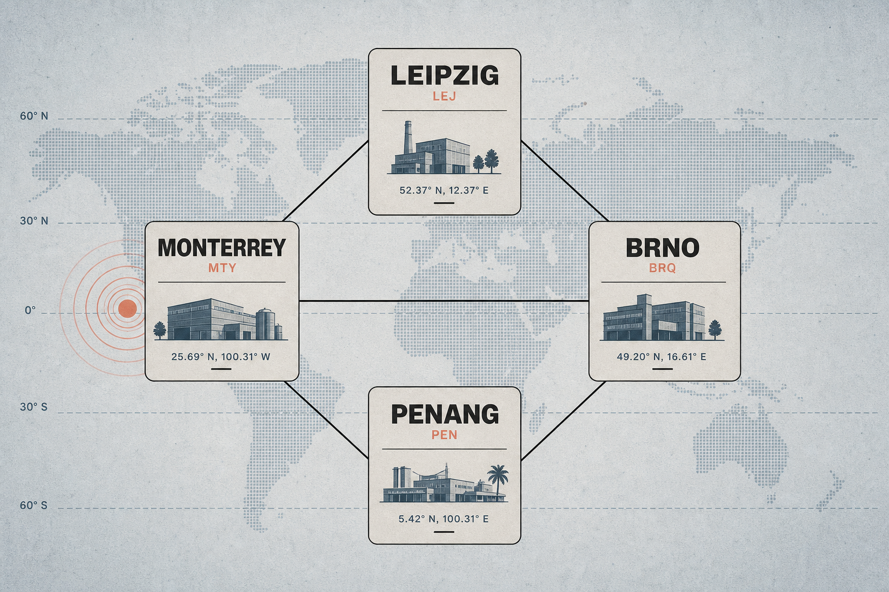
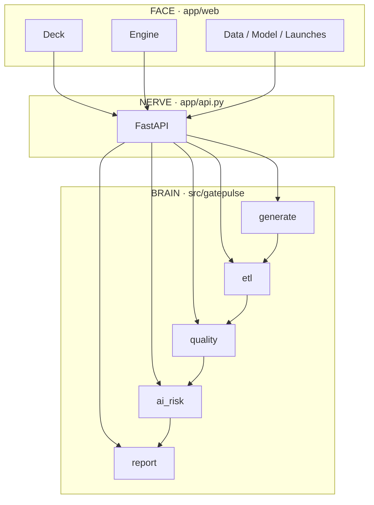

<p align="center">
  
</p>

<p align="center">
  <strong>GATEPULSE</strong><br/>
  <em>See the launch. Trust the pipeline.</em>
</p>

<p align="center">
  
  
  
  
</p>

---

## The map

Four plants. One pulse.

<p align="center">
  
</p>

| Code | Plant | Role in the demo |
|:----:|:------|:-----------------|
| **LEJ** | Leipzig | EU launch office gravity |
| **BRQ** | Brno | Supplier / pilot pressure |
| **MTY** | Monterrey | Americas cutover heat |
| **PEN** | Penang | APAC logistics & MES |

Everything on this map is fictional. The coordination problem is not.

---

## The nerve

<p align="center">
  
</p>

```text
 RAW checklists ──► ETL wash ──► SQLite
                         │
                         ▼
                   launch facts ──► quality score
                         │               │
                         └────► slip-risk model ──► Deck / labs / Excel
```

| Stage | You feel it as… |
|:-----:|:----------------|
| **RAW** | Messy milestone CSVs (bad dates, missing %, typo statuses) |
| **WASH** | Cleaner that repairs + logs every fix |
| **STORE** | SQLite you can browse in **Data** |
| **SCORE** | Portfolio quality index |
| **RISK** | Offline RandomForest SOP-slip score |
| **DECK** | Browser glass — charts, insights, exports |

---

## The glass (UI rooms)

```text
┌────────┬──────────────────────────────────────────────┐
│  GP    │  Deck   Engine   Data   Model   Launches …   │
│  rail  ├──────────────────────────────────────────────┤
│        │                                              │
│        │   ┌──────────────┐  ┌─────────────────────┐  │
│        │   │  headline    │  │  dark KPI pulse     │  │
│        │   └──────────────┘  └─────────────────────┘  │
│        │   ┌────────────────┐ ┌──────────────────┐    │
│        │   │ plant health   │ │ AI read-out      │    │
│        │   └────────────────┘ └──────────────────┘    │
│        │                                              │
└────────┴──────────────────────────────────────────────┘
         ▲                              ▲
    brand spine                   command canvas
```

| Open this | Look for this |
|:----------|:--------------|
| **Deck** | KPIs · plant bars · AI tips · scatter risk map |
| **Engine** | Stage buttons · live terminal · artifact list |
| **Data** | RAW ‖ CLEAN split · SQLite · quality pie |
| **Model** | Holdout metrics · feature bars · what-if levers |
| **Launches** | One program → gate bars → tasks |
| **Exports** | Excel + Markdown steering pack |

> First visit gets a **spotlight tour**.  
> Missed it? Top-right → **Take tour**. Esc closes.

---

## Ignition

<p align="center">

| ① | ② | ③ | ④ | ⑤ |
|:-:|:-:|:-:|:-:|:-:|
| clone | venv | pip | pipeline | open glass |

</p>

```powershell
git clone https://github.com/WinstonMascarenhas1006/GatePulse.git
cd GatePulse
python -m venv .venv
.\.venv\Scripts\activate
pip install -r requirements.txt
python scripts\run_pipeline.py
uvicorn app.api:app --reload --port 8080
```

<p align="center"><strong>→ http://localhost:8080</strong></p>

Demo choreography (90 seconds):

```text
Engine  →  Run full pipeline  →  watch terminal
   ↓
Deck    →  KPIs refresh
   ↓
Data    →  RAW vs CLEAN
   ↓
Model   →  move a slider → Score
```

---

## System sketch



```text
app/web/           face
app/api.py         nerve
src/gatepulse/     brain
scripts/           ignition keys
docs/assets/       pictures for this page
docs/              decisions · CV · transfer notes
tests/             smoke alarms
```

---

## AI without the fog machine

```text
features ──► RandomForest ──► score 0–100 ──► High / Medium / Low
                    │
                    ├── feature importance chart
                    └── what-if scorer (Model room)
```

Runs offline. No API key. Small-N metrics stay honest on screen.

---

## Why this story exists

Skills practiced: planning data · checklist QA · automation · dashboards · AI prioritization · multi-plant ops.

Story chosen: **NPI / SOP launch readiness** — not a photocopy of any single certification job ad.

Careful interview wording → [`docs/SKILL_TRANSFER.md`](docs/SKILL_TRANSFER.md)  
Build memory → [`docs/DECISION_LOG.md`](docs/DECISION_LOG.md)  
CV lines → [`docs/CV_BULLETS.md`](docs/CV_BULLETS.md)

---

<p align="center">
  
</p>

<p align="center">
  <sub>MIT · Helion Industrial is fictional · synthetic data only</sub><br/>
  <b>See the launch.</b> <i>Trust the pipeline.</i>
</p>
