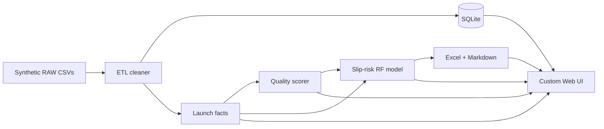

# GatePulse

```
   ██████╗  █████╗ ████████╗███████╗██████╗ ██╗   ██╗██╗     ███████╗███████╗
  ██╔════╝ ██╔══██╗╚══██╔══╝██╔════╝██╔══██╗██║   ██║██║     ██╔════╝██╔════╝
  ██║  ███╗███████║   ██║   █████╗  ██████╔╝██║   ██║██║     ███████╗█████╗  
  ██║   ██║██╔══██║   ██║   ██╔══╝  ██╔═══╝ ██║   ██║██║     ╚════██║██╔══╝  
  ╚██████╔╝██║  ██║   ██║   ███████╗██║     ╚██████╔╝███████╗███████║███████╗
   ╚═════╝ ╚═╝  ╚═╝   ╚═╝   ╚══════╝╚═╝      ╚═════╝ ╚══════╝╚══════╝╚══════╝
```

### The control room for launches that refuse to go quietly.

> Factories don’t miss Start-of-Production because someone forgot a slide.  
> They miss it because **gates go opaque** — tooling, pilots, training, MES cutovers —  
> scattered across plants, spreadsheets, and “I’ll update you Friday.”

**GatePulse** is a fully working portfolio system that makes that opacity impossible to ignore:  
synthetic multi-plant NPI data → ruthless ETL + quality scoring → offline AI slip-risk →  
a custom **Deck / Engine / Data / Model** UI where the backend is visible, not hidden.

[](./requirements.txt)
[](./app/api.py)
[](./src/gatepulse/ai_risk.py)
[](./LICENSE)

**Live story world:** Helion Industrial *(fictional)* · Plants: **Leipzig · Brno · Monterrey · Penang**

---

## 60-second pitch

| If you only remember one sentence… | Remember this |
|---|---|
| What it is | A launch-readiness intelligence stack for NPI / SOP gates |
| What you open | `http://localhost:8080` — custom UI, not a notebook dump |
| What makes it different | **Engine Room** lets you *run the Python pipeline from the browser* |
| What the AI does | Scores which launches are most likely to slip SOP — offline, no API keys |
| What it is *not* | Real OEM confidential data · not a clone of any single job posting |

---

## The dual brain (front + back in one glass)

Most demos show charts and pretend the sausage factory doesn’t exist.

GatePulse shows **both**:

```
┌─────────────────────────────────────────────────────────────┐
│  DECK / LAUNCHES / EXPORTS     ←  what a planner sees       │
│  (frontend command surface)                                 │
├─────────────────────────────────────────────────────────────┤
│  ENGINE · DATA · MODEL         ←  how the numbers are born  │
│  (backend under glass)                                      │
│                                                             │
│   generate → ETL → quality → AI risk → Excel/brief          │
└─────────────────────────────────────────────────────────────┘
```

| Surface | What a beginner should do there |
|---|---|
| **Deck** | Read KPIs, plant health, AI tips — meeting mode |
| **Engine** | Hit **Run full pipeline** — watch the terminal prove it’s real Python |
| **Data** | Compare **RAW vs CLEANED** milestones + poke SQLite |
| **Model** | Drag what-if levers; call the saved RandomForest live |
| **Launches** | Drill one program → gate timeline → tasks |
| **Exports** | Download the steering pack |

First visit? An interactive **spotlight tour** starts once (Driver.js).  
Replay anytime with **Take tour**. Choice sticks in `localStorage` (`gatepulse_tour_v1`).

---

## Architecture (honest, not mystical)



| Layer | Path | Role |
|---|---|---|
| Brain | `src/gatepulse/` | generate · etl · quality · ai_risk · report · engine |
| Nerve | `app/api.py` | FastAPI routes the UI actually calls |
| Face | `app/web/` | HTML / CSS / JS control surface |
| Ritual | `scripts/run_pipeline.py` | one-command offline refresh |
| Paper trail | `docs/DECISION_LOG.md` | every product decision + idea source |

---

## Quick start (Windows)

```powershell
git clone https://github.com/WinstonMascarenhas1006/GatePulse.git
cd GatePulse
python -m venv .venv
.\.venv\Scripts\activate
pip install -r requirements.txt
python scripts\run_pipeline.py
uvicorn app.api:app --reload --port 8080
```

Open **http://localhost:8080**  
(Optional legacy skin: `streamlit run app/streamlit_app.py` — kept for archaeology, not the main act.)

> **Pro move for demos:** open **Engine → Run full pipeline**, then flip to **Deck**.  
> That’s the “I built a system, not a screenshot” moment.

---

## What “AI” means here (no fog machine)

- **Model:** `RandomForestClassifier` on launch features (complexity, open/blocked work, slip history, plant, priority, family, quality score)
- **Output:** slip-risk score 0–100 + High / Medium / Low
- **Extras:** feature-importance chart + what-if scorer in **Model**
- **Honesty badge:** small-N holdout metrics can look weird — the UI doesn’t hide that. Interviewers respect candor.

---

## Domain choice (why this story)

GatePulse practices the *skills* behind planning analytics, data quality, dashboards, automation, and AI prioritization — in a **multi-plant NPI / SOP** narrative.

It deliberately does **not** clone a specific employer certification workflow.  
Transfer notes for interviews: [`docs/SKILL_TRANSFER.md`](./docs/SKILL_TRANSFER.md)

---

## Repo map

```
GatePulse/
├── app/
│   ├── api.py              ← FastAPI (primary server)
│   └── web/                ← the face (index · css · app.js · tour.js)
├── src/gatepulse/          ← the brain
├── scripts/                ← pipeline + run helpers
├── docs/                   ← charter · CV bullets · decision log · report outline
├── tests/                  ← smoke tests
└── data/                   ← raw | processed | exports (generated locally)
```

---

## For your CV (steal responsibly)

Ready-to-edit bullets live in [`docs/CV_BULLETS.md`](./docs/CV_BULLETS.md).

One-liner:

> **GatePulse** — multi-plant NPI launch-readiness analytics: ETL + data quality, custom FastAPI control surface, and offline AI SOP-slip risk scoring.

---

## License & fiction notice

MIT.  
**Helion Industrial**, plant programs, and all datasets are **synthetic** — built for portfolio / learning demos.  
Not affiliated with any automotive OEM.

---

<p align="center">
  <b>See the launch.</b><br/>
  <i>Trust the pipeline.</i>
</p>
