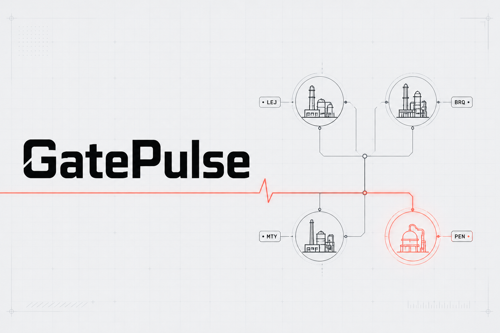
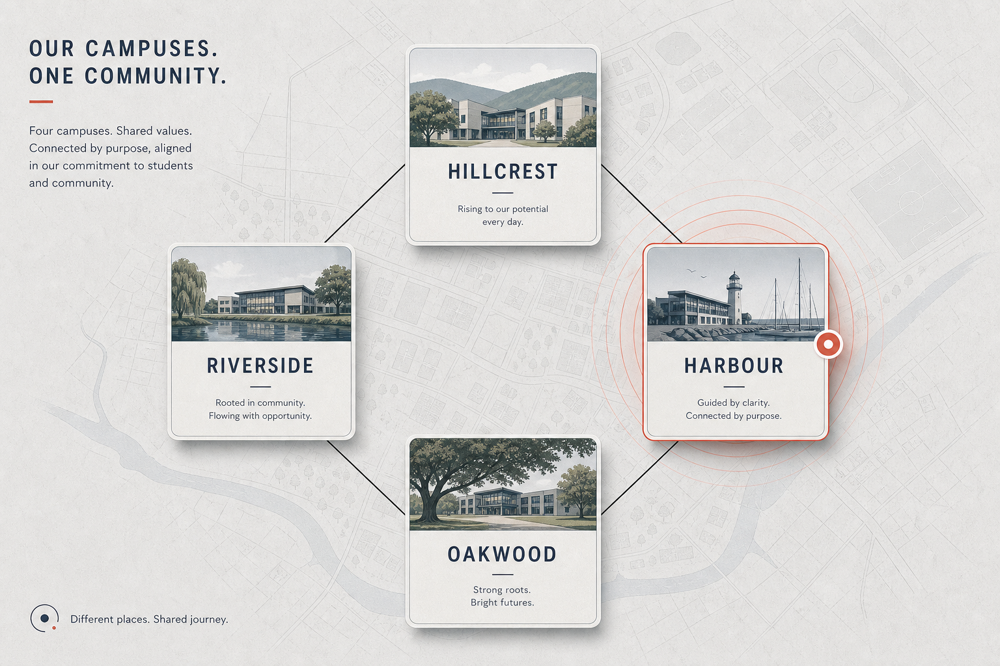
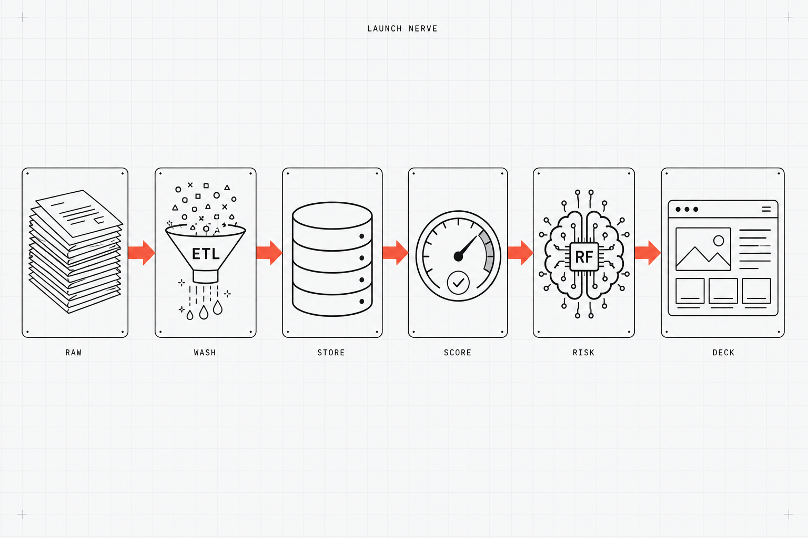

<p align="center">
  
</p>

<p align="center">
  <strong>GATEPULSE</strong><br/>
  <em>See the campus. Trust the pipeline.</em>
</p>

<p align="center">
  
  
  
  
</p>

---

## The map

One school group. Four campuses. Same exams calendar. Different chaos.

<p align="center">
  
</p>

| `campus_code` | Campus | Character |
|:-------------:|:-------|:----------|
| **RIV** | Riverside | City campus — MIS / devices pressure |
| **HIL** | Hillcrest | Suburban — staffing and rooms |
| **HAR** | Harbour | Coastal — invigilation and halls |
| **OAK** | Oakwood | Rural — comms and results processing |

Fictional group: **Northbridge Academies**.  
What is real: term start, mock series, public exams, inspection packs, parent reports.

Each programme run is a `launch_id` at one `campus_code`. There is no plant table — that name was a leftover from an earlier factory concept and has been removed.

---

## The nerve

<p align="center">
  
</p>

```text
 messy campus checklists ──► ETL wash ──► SQLite
                                  │
                                  ▼
                            programme facts ──► quality score
                                  │                  │
                                  └────► deadline-slip model ──► Deck / labs / Excel
```

| Stage | In school language |
|:-----:|:-------------------|
| **RAW** | Bad exam dates, missing progress, typo statuses |
| **WASH** | Cleaner that repairs and logs every fix |
| **STORE** | SQLite you can browse in **Data** |
| **SCORE** | How trustworthy is this campus checklist? |
| **RISK** | Which programmes will miss exam / term day? |
| **DECK** | SLT glass — charts, insights, exports |

---

## The glass

| Open this | Look for this |
|:----------|:--------------|
| **Deck** | KPIs · campus bars · AI tips · risk scatter |
| **Engine** | Run generate → ETL → quality → AI → export |
| **Data** | RAW ‖ CLEAN · SQLite · quality mix |
| **Model** | Feature importance · what-if scorer |
| **Campuses** | One programme → gate bars → tasks |
| **Exports** | Excel + Markdown for SLT |

First visit: spotlight tour. Missed it? **Take tour**. Esc closes.

---

## Ignition

```powershell
git clone https://github.com/WinstonMascarenhas1006/GatePulse.git
cd GatePulse
python -m venv .venv
.\.venv\Scripts\activate
pip install -r requirements.txt
python scripts\run_pipeline.py
uvicorn app.api:app --reload --port 8080
```

<p align="center"><strong>→ http://localhost:8080</strong></p>

```text
Engine  →  Run full pipeline
Deck    →  campus KPIs
Data    →  RAW vs CLEAN
Model   →  move a slider → Score
```

---

## Why schools (and what this still proves)

Same engine as before: planning gates, data quality, dashboards, automation, AI prioritization.

New story: **academic operations** across four campuses — not a random grades dump, not a factory clone.

Skills still transfer to any ops desk (including certification planning): deadlines, evidence packs, dirty source data, steering reports.

Interview notes → [`docs/SKILL_TRANSFER.md`](docs/SKILL_TRANSFER.md)  
CV lines → [`docs/CV_BULLETS.md`](docs/CV_BULLETS.md)  
Decision log → [`docs/DECISION_LOG.md`](docs/DECISION_LOG.md)

---

<p align="center">
  <sub>MIT · Northbridge Academies is fictional · synthetic data only</sub><br/>
  <b>See the campus.</b> <i>Trust the pipeline.</i>
</p>
